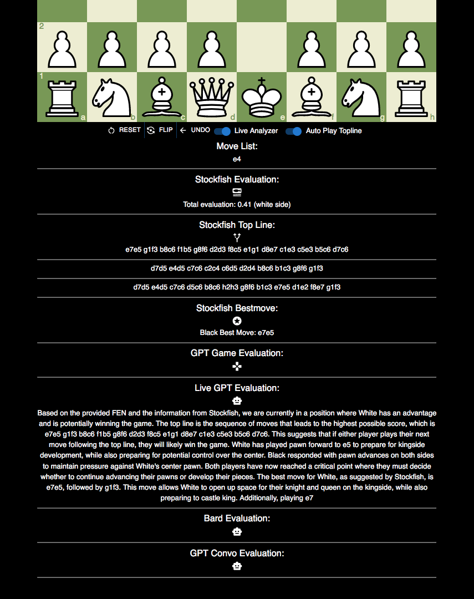

[](https://app.netlify.com/sites/chessxplain/deploys)

[](https://opensource.org/licenses/)

# chessXplain
Chessxplain is open source working prototype that demonstrates AI models can explain chess concepts

[Join Discord](https://discord.gg/PRQTXZXc8Z) [Try chessXplain](https://chessxplain.netlify.app/)

## Acknowledgements

 - [React Chessboard](https://github.com/Clariity/react-chessboard)
 - [Chess.js](https://unpkg.com/browse/chess.js@0.12.0/)
 - [Stockfish API](https://stockfish.online/)
 - [Stockfish](https://stockfishchess.org/)
 - [Lichess API](https://lichess.org/api)
 - [Lichess Opening Explorer](https://lichess.org/api#tag/Opening-Explorer)
 - [Lichess Games Database](https://lichess.org/api#tag/Games/operation/gamePgn)
 - [Google Prompt Guide](https://cloud.google.com/vertex-ai/docs/generative-ai/text/text-prompts)
 - [Material-UI](https://mui.com/material-ui/)


## Design


## Features

- Light/dark mode toggle
- Custom board colors
- Chess position analysis with Stockfish
- Auto play topline support
- Auto Stockfish lines, bestmove, eval with GPT commentary 
- Live analysis board
- Lichess game text based evaluation by chatGPT 3.5
- Support For GPT 3.5, Bard, GPT Conversation trained model


## Environment Variables

To run this project, you will need to add the following environment variable to your .env file
in ``` chessxplain/backend/.env ```

`REACT_APP_GPT_TOKEN`


## Run Frontend Locally

Clone the project

```bash
  git clone https://github.com/jalpp/chessxplain.git
```

Go to the project directory

```bash
  cd chessxplain

  cd chessxplain/src
```

Install dependencies

```bash
  npm install
```

Start the site

```bash
  npm run start
```

## Run Backend Locally

```
cd chessxplain/backend

node server.js
```
The server should start at port 5019


## ChessXplain API

chessxplain backend exposes API for clients to get chess AI explanations
in REST Protocol, hit API URL ```https://chessxplain.thexhosting.com/api```

### GET gpt text eval based on fen 

```
send GET request to 
https://chessxplain.thexhosting.com/api/gpt?fen={your fen}

```

### GET bard text eval based on fen

```
send GET request to 
https://chessxplain.thexhosting.com/api/bard?fen={your fen}

```

### GET GPT Convo model text eval based on fen

```
send GET request to 
https://chessxplain.thexhosting.com/api/convo?fen={your fen}

```
### GET GPT model text based game review for Lichess game

```
send GET request to 
https://chessxplain.thexhosting.com/api/gamereview?gameurl={lichess game}

```

## Screenshots





## Roadmap

- Lichess puzzle eval by AI

- Lichess study eval by AI

- PGN support

- Better UI

- More API endpoints

## Authors:

@jalpp


